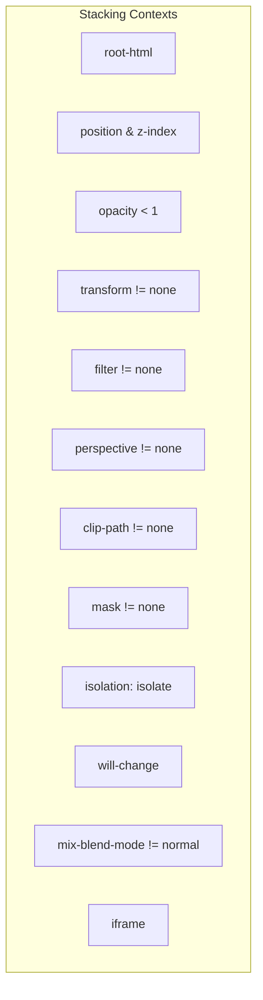
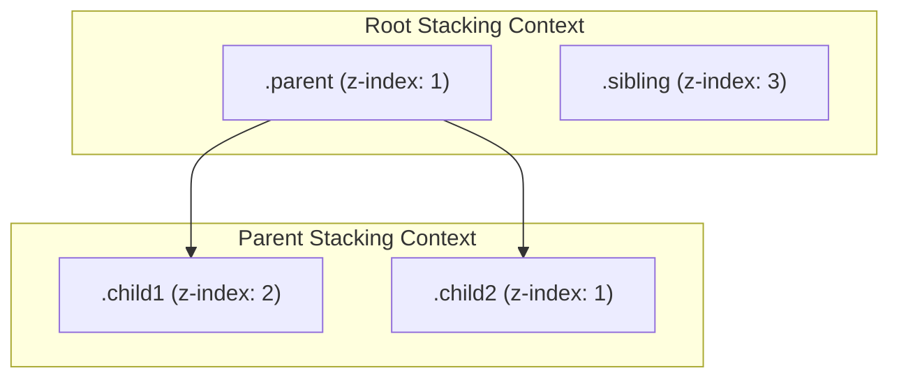

<TOCInlineWithSticky toHeading={3} toc={props.toc} />

### 创建独立堆叠上下文的方法

1.  根元素 `(<html>)`
2.  有 position 属性且 z-index 值不为 auto 的元素
3.  opacity 小于 1 的元素
4.  transform 属性且值不为 none 的元素
5.  filter 属性且值不为 none 的元素
6.  perspective 属性且值不为 none 的元素
7.  clip-path 属性且值不为 none 的元素
8.  mask 属性且值不为 none 的元素
9.  isolation: isolate 的元素
10. will-change 属性且值为 opacity、transform 等的元素
11. mix-blend-mode 属性且值不为 normal 的元素
12. `<iframe>` 元素



**html 示例**

```html
<!doctype html>
<html lang="en">
  <head>
    <meta charset="UTF-8" />
    <meta name="viewport" content="width=device-width, initial-scale=1.0" />
    <style>
      .parent {
        position: relative;
        z-index: 1;
        background-color: lightgrey;
        width: 200px;
        height: 200px;
      }
      .child1 {
        position: relative;
        z-index: 2;
        background-color: red;
        width: 100px;
        height: 100px;
      }
      .child2 {
        position: relative;
        z-index: 1;
        background-color: blue;
        width: 100px;
        height: 100px;
        margin-top: -50px; /* 使其与 .child1 部分重叠 */
      }
      .sibling {
        position: relative;
        z-index: 3;
        background-color: green;
        width: 100px;
        height: 100px;
        margin-top: -150px; /* 使其与 .parent 部分重叠 */
      }
    </style>
  </head>
  <body>
    <div class="parent">
      <div class="child1"></div>
      <div class="child2"></div>
    </div>
    <div class="sibling"></div>
  </body>
</html>
```



### 在 js 中等待 css 的动画执行结束

```ts
const animations = document.getAnimations().map((a) => a.finished)
await Promise.all(animations)
```

### 渐变 border 的 tailwind 实现

```tsx
export const AnimatedGradientBorderTW: React.FC<{
  children: React.ReactNode
}> = ({ children }) => {
  const boxRef = useRef<HTMLDivElement>(null)

  useEffect(() => {
    const boxElement = boxRef.current

    if (!boxElement) {
      return
    }

    const updateAnimation = () => {
      const angle = (parseFloat(boxElement.style.getPropertyValue('--angle')) + 0.5) % 360
      boxElement.style.setProperty('--angle', `${angle}deg`)
      requestAnimationFrame(updateAnimation)
    }

    requestAnimationFrame(updateAnimation)
  }, [])

  return (
    <div
      ref={boxRef}
      style={
        {
          '--angle': '0deg',
          '--border-color': 'linear-gradient(var(--angle), #070707, #687aff)',
          '--bg-color': 'linear-gradient(#131219, #131219)',
        } as CSSProperties
      }
      className="flex h-[400px] w-[400px] items-center justify-center rounded-lg border-2 border-[#0000] p-3 [background:padding-box_var(--bg-color),border-box_var(--border-color)]"
    >
      {children}
    </div>
  )
}
```

### 在屏幕缩放比例发生改变页面不变的处理方案

1. 首页第一个模块所有的 100vh 全部要动态的改变为 calc（100vh \* 2）
2. 视频的宽度需要调整为 100%（视频动效会没）
3. 登录模态框内部的逻辑调整为 zoom 处理

- 暂定有问题的动效模块直接不展示
- 另外注入 URS 模态框的 css 可以区分 Win 还是 Mac

### antd-mobile css 变量覆盖

```css
:root:root {
  --adm-button-border-radius: 2px;
}
```
