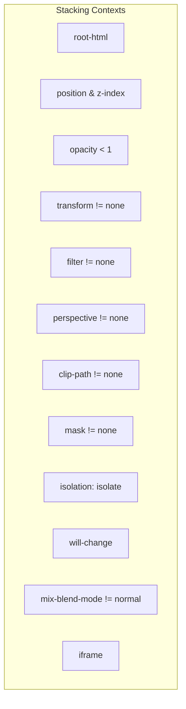
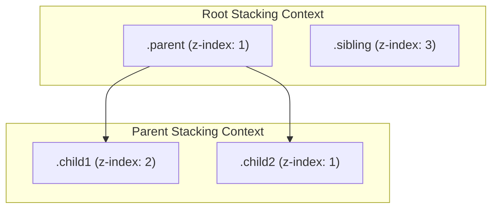

<TOCInlineWithSticky toHeading={3} toc={props.toc} />

#### 2024-11-11

- 关于 jotai 在第三方包中导出使用的时候确保 dan'li 式

#### 2024-11-08

一个 mp4 的链接文件，一般需要满足资源响应头信息中有下面的内容才可以直接在浏览器播放，否则会直接要求文件下载

```
Content-Type: video/mp4
Content-Disposition: inline
Accept-Ranges？: bytes
```

另外浏览器一般支持下面的编码格式

```
1. H.264 (AVC)
   - 广泛支持：几乎所有现代浏览器都支持这种格式。
   - 常见容器：MP4。
   - 优势：兼容性好，压缩效率高，适合流媒体。

2. VP8
   - 支持：主要在 Chrome、Firefox 和 Opera 中得到广泛支持。
   - 常见容器：WebM。
   - 优势：开源，良好的压缩效率。

3. VP9
   - 支持：Chrome、Firefox、Opera 和 Edge。
   - 常见容器：WebM。
   - 优势：比 VP8 和 H.264 更高的压缩效率，尤其适合高分辨率视频。

4. AV1
   - 支持：逐渐在 Chrome、Firefox 和 Edge 中得到支持。
   - 常见容器：WebM。
   - 优势：最新的开源编码格式，提供更高的压缩效率。
```

下面的编码格式支持有限

```
1. H.265 (HEVC)
   - 支持：Safari 浏览器较好支持，其他浏览器支持有限。
   - 常见容器：MP4、MKV。
   - 优势：比 H.264 更高的压缩效率，适合高分辨率视频。

2. Theora
   - 支持：Firefox 和部分开源浏览器。
   - 常见容器：Ogg。
   - 优势：开源，但压缩效率低于 H.264 和 VP8。

3. MPEG-4 Part 2
   - 支持：逐渐减少，因为 H.264 的广泛普及。
   - 常见容器：MP4、AVI。
```

#### 2024-11-05

- antd 有 [API useFormInstance](https://ant-design.antgroup.com/components/form-cn#formuseforminstance)

### 2024-10-29

**css**

- unocss 引入的 tailwind 支持 container query 语法

```tsx
{
  /* 标识你要检测的容器 */
}
;<div className="@container">
  {/* 在容器宽度大于等于 500px 的时候响应后面的原子类 */}
  <div className="@[500px]:hidden">child</div>
</div>
```

**jts**

- PubSub.js 取消订阅不同的区别

1. 通过订阅令牌（token）取消订阅：当你订阅一个主题时，PubSub.js 会返回一个令牌，你可以使用这个令牌来取消订阅。

```ts
var token = PubSub.subscribe('myTopic', mySubscriberFunction)
PubSub.unsubscribe(token)
```

2. 通过主题名称取消订阅：你也可以通过主题名称取消所有该主题的订阅者。

```ts
PubSub.unsubscribe('myTopic')
```

| 取消订阅方式                  | 特点与区别                                                                                                 | 适用场景                                                         |
| ----------------------------- | ---------------------------------------------------------------------------------------------------------- | ---------------------------------------------------------------- |
| 通过订阅令牌（token）取消订阅 | <div>- 精确性：只取消与该令牌关联的特定订阅。</div> <div>- 作用范围：仅影响单个订阅。 </div>               | 需要取消特定订阅而不影响其他订阅的场景。                         |
| 通过主题名称取消订阅          | <div>- 广泛性：取消该主题下的所有订阅者。</div> <div> - 作用范围：影响所有在该主题上注册的回调函数。</div> | 需要清理某个主题的所有订阅者的场景，如应用程序关闭或模块卸载时。 |

### 2024-10-28

**css**

- word-break 只对英文生效，中文默认会换行，部分场景如果被设置了 white-space: nowrap 需要自己重新设置为 normal 或者其他数值（antd Card 的 Title 部分被设置了 nowrap）
  [彻底搞懂 word-break、word-wrap、white-space](https://juejin.cn/post/6844903667863126030)
- ToolTip 的 children 需要有 onMouseEnter、onMouseLeave、onFocus、onClick 的事件支持才可以生效
  - 如果你一个自定义的 React 组件作为 Tooltip 的 children，没有响应相关的事件就就不能正常使用 Tooltip

**UI 业务**

- Modal.Confirm 默认只支持确定和取消两个按钮，可以用 css 隐藏默认的按钮区域，在 content 中手动写 Button 来实现具体的业务需求

**通用**

- 用 npm 发包 pnpm 的仓库，npm 的发包会保留 workspace:\*之类的明文而不会替换确切的版本号

### 2024-07-23

创建独立堆叠上下文的方法

1.  根元素 `(<html>)`
2.  有 position 属性且 z-index 值不为 auto 的元素
3.  opacity 小于 1 的元素
4.  transform 属性且值不为 none 的元素
5.  filter 属性且值不为 none 的元素
6.  perspective 属性且值不为 none 的元素
7.  clip-path 属性且值不为 none 的元素
8.  mask 属性且值不为 none 的元素
9.  isolation: isolate 的元素
10. will-change 属性且值为 opacity、transform 等的元素
11. mix-blend-mode 属性且值不为 normal 的元素
12. `<iframe>` 元素



**html 示例**

```html
<!doctype html>
<html lang="en">
  <head>
    <meta charset="UTF-8" />
    <meta name="viewport" content="width=device-width, initial-scale=1.0" />
    <style>
      .parent {
        position: relative;
        z-index: 1;
        background-color: lightgrey;
        width: 200px;
        height: 200px;
      }
      .child1 {
        position: relative;
        z-index: 2;
        background-color: red;
        width: 100px;
        height: 100px;
      }
      .child2 {
        position: relative;
        z-index: 1;
        background-color: blue;
        width: 100px;
        height: 100px;
        margin-top: -50px; /* 使其与 .child1 部分重叠 */
      }
      .sibling {
        position: relative;
        z-index: 3;
        background-color: green;
        width: 100px;
        height: 100px;
        margin-top: -150px; /* 使其与 .parent 部分重叠 */
      }
    </style>
  </head>
  <body>
    <div class="parent">
      <div class="child1"></div>
      <div class="child2"></div>
    </div>
    <div class="sibling"></div>
  </body>
</html>
```



### 2024-4-22

**对于 npm 发包的进一步认识**

如果没有特别声明发包需要 includes 的文件目录，会发布源码文件

**对于 vite 配置中的 optimizeDeps 有了更多的认识**

- 默认 vite 是不会对 node_modules 的代码做预编译处理的，预编译包括对 commonjs 转换成 esm 的处理等其他兼容性和大小优化
- 而 src 中的文件 vite 默认会处理
- 因此如果 node_modules 包含不能在浏览器直接运行的代码，需要使用 optimizeDeps 显示声明定义

```js
// vite.config.js
// 下面是一个显示预处理 is-mobile 这个 node_module 的声明
export default {
  optimizeDeps: {
    include: ['is-mobile'],
  },
}
```

### 2024-01-23

在写非 UI 组件相关的 node 包的时候才感受到 cjs 和 esm 的很多 API 的差异

内置的**dirname 和**filename 不再适用，现在细想来这个 API 的设计确实蛮奇怪的，在 esm 实现的基本都基于 import.meta 这个内置的 API

动态通过 require 来导入的方法也不再适用，需要通过动态 import 来实现相关的需求

另外比较常见的就是导入和导出的区别了

另外就是迷惑的 package.json 里面的字段了，不过好在现在有了新的规范了，自己还没真的开始尝试使用

```json
 "exports": {
    ".": {
      "types": "./dist/index.d.ts",
      "import": "./dist/index.mjs",
      "require": "./dist/index.cjs"
    },
    "./package.json": "./package.json"
  },
```

### [兼容性](/blog/resources-save/tech-note/compatibility)

### [git](/blog/resources-save/tech-note/git)

### [node](/blog/resources-save/tech-note/node)

### [React](/blog/resources-save/tech-note/react)

### [CSS](/blog/resources-save/tech-note/css)

### [脚手架](/blog/resources-save/tech-note/scaffolding)

### [Nginx](/blog/resources-save/tech-note/nginx)

### [Canvas](/blog/resources-save/tech-note/canvas)

### [WebGL](/blog/resources-save/tech-note/webgl)

### [sh](/blog/resources-save/tech-note/sh)

### [H5](/blog/resources-save/tech-note/h5)

### [antd](/blog/resources-save/tech-note/antd)
