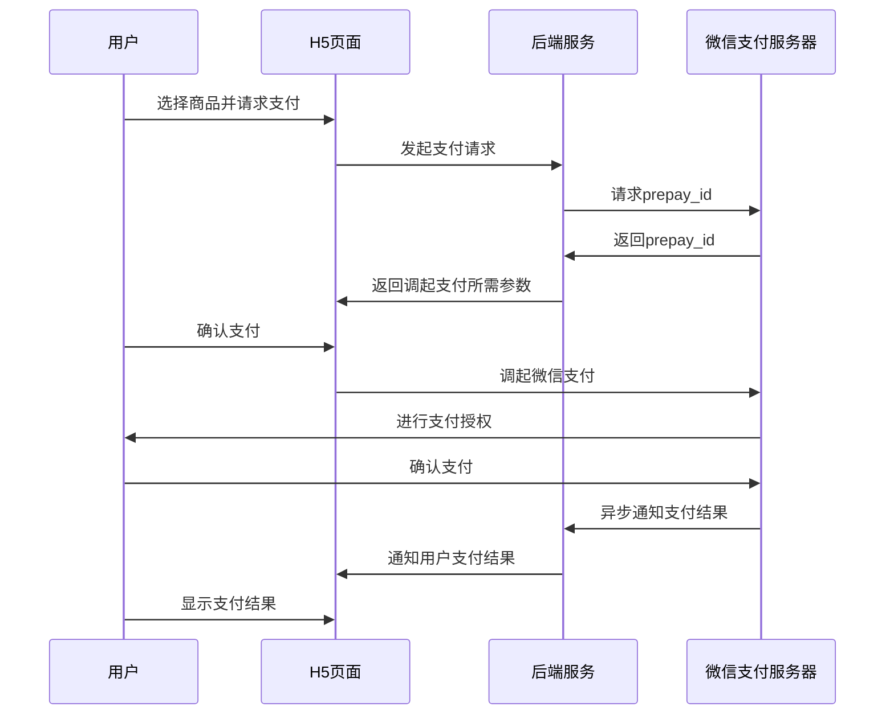

<TOCInlineWithSticky toc={props.toc} />

## H5 页面接入微信支付相关问答

**Q**
可以给我 H5 页面接入微信支付需要开发梳理的具体链路的流程图吗，用 Mermaid 的格式展示

**A**
Mermaid 是一种基于文本的图表创建工具，可以用来生成流程图、时序图等。下面是一个基于 Mermaid 语法的微信 H5 支付的简单流程图，它展示了接入微信支付的基本步骤。

请注意，具体实现过程可能根据业务需求和微信官方的更新变化而有所不同。以下是一个基本示例：

以上流程包含以下步骤：

1. 用户在 H5 页面上选择商品，并请求发起支付。
2. H5 页面将支付请求发送到后端服务。
3. 后端服务根据请求调用微信支付的统一下单 API，向微信支付服务器发送包含订单详情的请求。
4. 微信支付服务器处理请求并返回预支付交易会话标识（`prepay_id`）。
5. 后端服务将调起微信支付所需的参数传回 H5 页面。
6. 用户在 H5 页面上确认支付，触发调起微信支付。
7. H5 页面通过微信 JS-SDK 调起微信支付。
8. 用户在微信支付界面完成支付授权。
9. 微信支付服务器将支付结果异步通知给后端服务。
10. 后端服务将支付结果通知 H5 页面。
11. 用户在 H5 页面上看到支付结果。

这个流程图是一个简化的版本，实际的支付流程会更加复杂，涉及到安全性、异常处理等多个方面。此外，为了调用微信支付，你的后端服务需要完成微信支付接口的权限认证，并确保所有的交易都是安全的。这通常涉及到证书的配置，以及签名的生成和验证。在开发过程中，你应该详细阅读微信官方文档，以便了解最新的接口规范和安全要求。

**Q**
可以再多给一些权限认证相关的细节吗？

**A**
当然可以。微信支付的权限认证是一个关键步骤，确保交易的安全性和数据的完整性。以下是微信支付权限认证的一些基本步骤：

### 1. 注册并认证微信公众号或微信小程序

要使用微信支付，你需要有一个已经认证的微信公众号或小程序。认证过程通常包括提供企业信息，通过微信的审核等步骤。

### 2. 开通微信支付功能

一旦公众号或小程序被认证，你需要在微信公众平台开通微信支付功能。这通常要求你提供进一步的企业信息，包括但不限于营业执照、组织机构代码证、税务登记证等。

### 3. 配置 API 安全

微信支付要求使用 APIv3 密钥进行加密通讯。这涉及到以下几个步骤：

- **APIv3 密钥**：在微信商户平台设置 APIv3 密钥，这是调用微信支付 API 时用于生成签名的密钥。
- **商户 API 证书**：下载商户 API 证书，用于双向 SSL 认证。
- **IP 白名单**：在微信商户平台设置服务器的 IP 地址，只有白名单内的 IP 地址才能调用微信支付 API。

### 4. 数据签名

发送到微信支付的每个请求都需要包含一个签名，该签名是使用 APIv3 密钥和请求数据按照特定规则生成的。签名用以验证请求的真实性和完整性。

### 5. 生成预支付交易会话标识

在用户发起支付请求时，后端服务需要向微信支付服务器发起统一下单请求，这个请求需要包括如下认证信息：

- **签名**：确保请求没有被篡改。
- **商户号**：你的微信支付商户号。
- **小程序 ID 或公众号 ID**：发起支付请求的小程序或公众号的 ID。
- **随机字符串**：确保每次请求的唯一性。

### 6. 接收异步通知

微信支付完成后，微信支付服务器会向你的后端服务器发送支付结果通知。这个通知同样包含签名，后端服务需要验证这个签名确保通知的真实性。

### 7. 请求支付结果查询

为了双重验证支付结果的正确性，后端服务在接收到支付结果通知后，可以主动调用查询接口，以确认支付的最终结果。

### 8. 返回前端调起支付

后端服务在完成上述步骤后，将微信支付所需参数传回前端，前端通过微信 JS-SDK 调起微信支付。

### 9. 完成支付

用户在微信支付页面完成支付流程。

### 10. 验证支付结果

支付完成后，前端可以提示用户支付成功或失败，并可以通过调用后端服务的查询接口来获取最终的支付结果。

在整个流程中，确保安全性的关键措施包括：

- 使用 HTTPS 协议保护数据传输过程。
- 使用 APIv3 密钥和商户 API 证书进行数据签名和双向 SSL 认证。
- 验证微信支付服务器发送的支付结果通知签名。

以上步骤是一个高层次的概述，具体实现时需要遵循微信官方文档提供的详细指南，并且要更新到最新的 API 版本和安全规范。